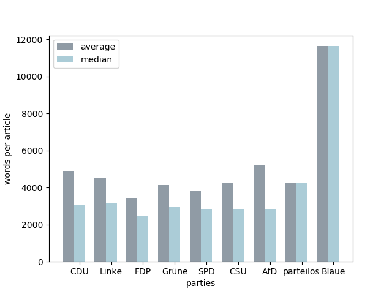
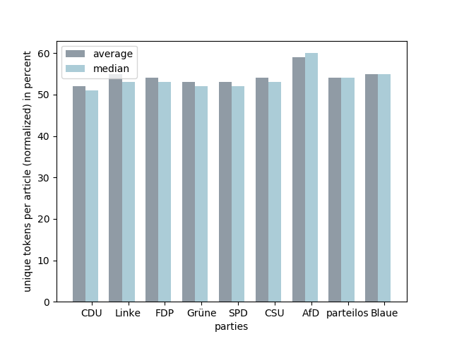
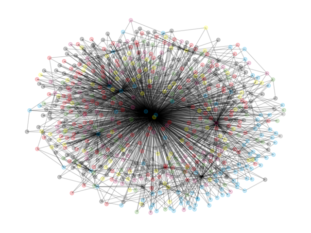

# Analysing Wikipedia articles about members of the German Bundestag

> **Date:** 23.04. *(Due: 23.04.)*  
> **Name:** `PhTr` Philipp Trenz  
> **Code:** [git](https://github.com/philipptrenz/Text-Visualisation-in-Practice/tree/master/02_tfidf)  
> **Session:** [TFIDF/VSM + Visualization](../index)

----

To experiment with TF-IDF and Vector Space Model I'm using data from Wikipedia regarding the current members of the German Bundestag. Therefore [this](https://de.wikipedia.org/wiki/Liste_der_Mitglieder_des_Deutschen_Bundestages_(19._Wahlperiode)#Abgeordnete) table got parsed as a resource of all Bundestag members. In the following the regarding Wikipedia articles of all 709 members got extracted as plain text using the Wikipedia API.

The resulting articles look like this:

```
Doris Maria Achelwilm (* 30. November 1976 in Thuine) ist eine deutsche Journalistin und Politikerin (Die Linke). Achelwilm war von 2013 bis 2017 Vorsitzende („Landessprecherin“) des bremischen Landesverbandes der Linken. Im Zuge der Bundestagswahl 2017 zog sie über die Bremer Landesliste der Linken in den 19. Bundestag ein.


== Leben ==


=== Ausbildung und Beruf ===
Doris Achelwilm wurde 1976 in Thuine (Landkreis Emsland) geboren und wuchs in Fürstenau auf. Nach ihrem Abitur am Gymnasium Leoninum Handrup studierte sie Deutsche Sprachwissenschaft, Politik und Geschichte an der Leibniz-Universität Hannover. Zeitweise arbeitete Achelwilm als Kultur- und Musikjournalistin und ist seit November 2007 Pressesprecherin der Fraktion Die Linke der Bremischen Bürgerschaft.Achelwilm wohnt in Bremen-Walle.


=== Politisches Engagement ===
Achelwilm ist Mitglied der Partei Die Linke und engagiert sich für die Partei seit mehreren Jahren. Zwischen 2009 und 2011 hatte sie die Position der Sprecherin des Kreisverbandes Bremen Mitte-Ost inne, bevor sie im November 2011 in den Vorstand des bremischen Landesverbandes nachrückte. Auf dem Parteitag der Partei Die Linke Bremen im November 2013 wählten die Mitglieder Achelwilm als Co-Vorsitzende („Landessprecherin“). Sie gehört dem Flügel der Emanzipatorischen Linken an.Des Weiteren ist Achelwilm Mitglied bei ver.di, dem Bremer Erwerbslosenverband e.V. Sie bezeichnet sich als „aktive Parzellistin“ in einem Kleingarten in Findorff.


=== Abgeordnete ===
Im Oktober 2016 kandidierte Achelwilm für eine mögliche Aufstellung als Kandidatin für die Bundestagswahl 2017. Der Landesparteitag der bremischen Linken wählte Achelwilm auf den ersten Platz der Landesliste. Damit gewann sie gegen die zwischen 2015 und 2017 im Bundestag vertretene Birgit Menz. Auf eine Aufstellung als Direktkandidatin in einem der beiden Bremer Wahlkreise verzichtete sie. Im Wahlkampf setzte Achelwilm auf sozialpolitische Themen und übte Kritik an der Politik der Bundesregierung zu Hartz IV, Mini-Jobs und Leiharbeit.Bei der Bundestagswahl 2017 erreichte Die Linke im Land Bremen ein Zweitstimmenergebnis von 13,5 Prozent hinter SPD und CDU. Damit zog Achelwilm als einzige Kandidatin der Linken (und als eines von sechs Bremer Mitglieder des Bundestages) über die Landesliste in den 19. Deutschen Bundestag.
Achelwilm ist Sprecherin der Fraktion DIE LINKE im Bundestag für Gleichstellung, Medienpolitik und Queerpolitik. Sie ist ordentliches Mitglied im Ausschuss für Familie, Senioren, Frauen und Jugend und stellvertretendes Mitglied im Ausschuss für Kultur und Medien.


== Weblinks ==
Doris Achelwilm auf Abgeordnetenwatch
Offizieller Internetauftritt
Bremer Bundestagskandidaten antworten: Doris Achelwilm, Linke. Bunten und Binnen, 5. September 2017.
Biografie beim Deutschen Bundestag


== Einzelnachweise == 

```

In the following all numbers as well as the chapters 'weblinks', 'literatur' and 'einzelnachweise' got removed and the text got converted to lower case.



As a first investigation the number of words per articles for each party were examined. Therefore the average and median was calculated. The bar chart shows evenly distributed average and median article lengths per party, only the articles of the two members of "Die Blaue" are conspicuously young. This could result from the fact that the persons associated with this party, Frauke Petry and Mario Mieruch, are quite controversial personalities.



As a second step the uniqueness of tokens per party was considered. Therefore each article for each member of the German Bundestag got investigated towards the number of unique tokens in relation to the total number of tokens (in percent), the results were aggregated over each party. With just over 50%, the CDU has the less varied vocabulary, the most unique tokens per article has the AfD party. For the remaining parties average and median are relatively equally distributed.



To investigate the similarity in content of articles, the TF-IDF calculation got applied to all articles by using the __Scikit-learn TfidfVectorizer__ to generate data within the Vector Space Model. To visualize the similarity of the Wikipedia articles the cosine similarity measurement was applied for each member of the Bundestag by a 1-to-n dependence. Subsequently, an undirected graph with nodes as articles of all deputies of the German Bundestag and edges for the three most similar articles per member got generated. Since all the nodes with the names of the deputies were not expedient due to the number of 709 nodes, the nodes were instead colored in the respective party color.


When looking at the graph, some nodes with many edges are noticeable, so here is an enlarged view of the center of the graph, this time with labels. The nodes with the most edges belong to the following politicians:

* Gero Clemens Hocker (FDP)
* Thomas Ehrhorn (AfD)
* Andreas Wagner (Linke)
* Ulrike Schielke-Ziesing (AfD)
* Torsten Schweiger (CDU)
* Udo Hemmelgarn (AfD)
* Fabian Jacobi (AfD)

It is noticeable that many members of the AfD appear in this list. Why the similarity of the articles is so high especially for members of this party would have to be investigated in more detail.
