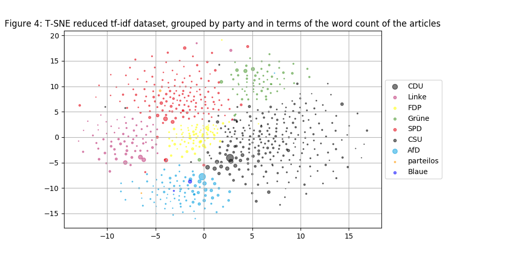

# Wikipedia articles about members of the German Bundestag (extended)

> **Date:** 28.04. *(Due: 29.04.)*  
> **Name:** `PhTr` Philipp Trenz  
> **Code:** [git](https://github.com/philipptrenz/Text-Visualisation-in-Practice/tree/master/03_dimension_reduction)  
> **Session:** [Dimensionality Reduction+PCA+tSNE+ Visualization](../index)

----

## Intro

The last session was focused on generating high dimensional data using the [tf-idf](https://en.wikipedia.org/wiki/Tf–idf) algorithm. Therefore the Wikipedia articles of all current 709 members of the German Bundestag got parsed and used as a database for the algorithm. In this this session, the focus is on reducing dimensions to 2 or 3 while keeping the containing information as high as possible. 

## Approach

In the lecture some algorithms for the reduction of dimensions were presented, among others [PCA](https://en.wikipedia.org/wiki/Principal_component_analysis) and [t-SNE](https://en.wikipedia.org/wiki/T-distributed_stochastic_neighbor_embedding). The Machine Learning framework _scikit-learn_, which was already used to calculate the tf-idf vectors for the Wikipedia articles, also provides implementations for both of the algorithms. 

As the _TfidfVectorizer_ interface of the framework generates a sparse dataset, which is not compatible to the PCA implementation in this form, for a first inquiry the t-SNE interface was used.

Since the database was created on the basis of [this](https://de.wikipedia.org/wiki/Liste_der_Mitglieder_des_Deutschen_Bundestages_(19._Wahlperiode)#Abgeordnete) Wikipedia table, in addition to the names of the members of the German Bundestag and the cross-references to the respective Wikipedia articles, the columns on party affiliation, year of the politician and state of origin were recorded. These data are now used to discover interesting relationships based on the tf-idf vector data reduced with t-SNE.

## Results

The following Figure 1 shows the result of the dimensionality reduced TF-IDF vectors per article based on the t-SNE algorithm, while the colors represent age groups of the politicians. 

In Figure 2, the vector representation of the articles gets represented in 3d in relation to the German home states of the politicians.

Figure 3 illustrates the vector text representation with respect to the parties of the politicians.

With reference to the article length (number of words per article), in contrast to Figure 3 in Figure 4, this is additionally illustrated by the scaling of the points.

## Findings

Regarding Figure 1, it can be stated that the colors of the data points are evenly distributed, so that no clustering regarding age groups can be found. 

Also in Figure 2, the data points look equally distributed – Except for the state _Bavaria_ (in the legend: _Bayern_), where one bigger cluster (with its center approximately at \[10, 5\]). 

This makes sense as soon as you compare Figure 3. There, the single-color cluster of the CSU party can be seen congruent. This party is an exclusively Bavarian party, which explains the origin of the politicians of this cluster.

In Figure 3, in general, the articles attributable to the parties are clearly delineated in the plot, and even clear demarcations of individual clusters from other parties are discernible. It is quite remarkable that such a clear classification of the Wikipedia article on members of the German Bundestag is possible only through statistical analysis of the word occurrence and without any understanding of the text.

Even the ideological origin and orientation of the politicians [Mario Mieruch](https://de.wikipedia.org/wiki/Mario_Mieruch) and [Frauke Petry](https://de.wikipedia.org/wiki/Frauke_Petry), who moved into the Bundestag with the AfD and in the meantime have converted to the [Die blaue Partei](https://de.wikipedia.org/wiki/Die_blaue_Partei), can be deduced from the scatter plot. The political proximity of the two Union parties, the CDU and the CSU, can also be recognized by a smooth transition of the two clusters. The two non-party politicians are clearly assignable: [Uwe Kamann](https://de.wikipedia.org/wiki/Uwe_Kamann) moved for the AfD in the Bundestag and left the party in December 2018. [Marco Bülow](https://de.wikipedia.org/wiki/Marco_Bülow), however, was a member of the SPD and also resigned in 2018 from the party.

In Figure 4 an attempt was made to incorporate further information in the 2D representation of the plot. The additionally shown length of the article could give information about the importance or disputedness of the associated person, but this was not further investigated for time reasons.

Further investigations of this kind could focus on the following points:

* Relevance of the position of an article of a politician in the cluster of the associated party
* Significance of textual proximity to "party boundaries" in the plot
* Meaningfulness of the t-SNE clusters on the basis of articles on members of parliament regarding the classification of party affiliation of state or local politicians
