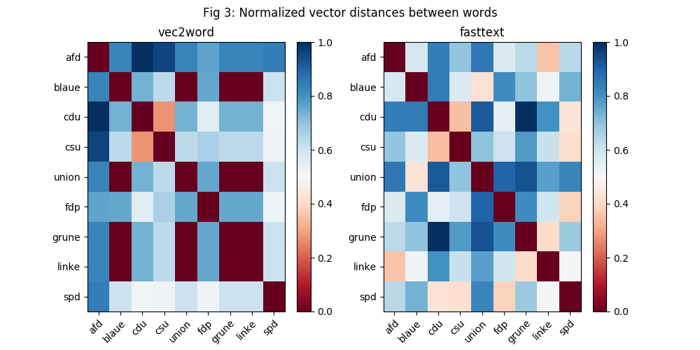

# ...

> **Date:** 04.05. *(Due: 07.05.)*  
> **Name:** `PhTr` Philipp Trenz  
> **Code:** [git](https://github.com/philipptrenz/Text-Visualisation-in-Practice/tree/master/04_word_embeddings)  
> **Session:** [Word Embeddings](../index)

----

## Intro

In last weeks blogpost I wrote about using tf-idf vectorization and
t-SNE dimensionality reduction for investigations on Wikipedia articles
of all 709 members of the German Bundestag. In this weeks blogpost I
continue this research by keeping the same source data. Nevertheless
this week is about _word embeddings_.

## Approach

To evaluate the possibilities of word embeddings, I decided to compare
the results of the two popular word embeddings algorithms _vec2word_ and
_fasttext_, which both are available within the _gensim_ Python library.
As the interfaces are implemented similar within the framework, a
comparable parameterisation is possible, which provides a good
comparability of the results. 

In order to increase the processability of the texts by the algorithms,
I have fundamentally revised the preprocessing pipeline compared to last
week. It now consists of the following steps:

* Tokenization
* Removal of non ASCII characters
* Conversion to lower case
* Removal of punctuation
* Replacement of numbers
* Removal of stop words
* Stemming of words
* Lemmatizing of words


## Results

The following parameterization was used both for vec2word and fasttext:

```
    size = 200       # Dimensionality of the word vectors
    window = 5       # The maximum distance between the current and predicted word within a sentence
    min_count = 50       # The model ignores all words with total frequency lower than this
    sentences = df['article']       #  List of lists of tokens
    total_examples = len(df['article'])       # Count of sentences
    epochs = 10       # Number of iterations (epochs) over the corpus
```

The first figure shows the plots of all word vectors generated by
vec2word and fasttext, reduced to two dimensions using t-SNE.


For further investigation the statistical similarity of words as well as
the semantic understanding should be looked at. For that Figure 2 shows
the plot of only the party names out of the wikipedia articles. In last
weeks research was found out that these tokens have led to a high
similarity between articles of politicians with the same party
affiliation.


Since Figure 2 is not very meaningful due to the different vector spaces
of the algorithms and the poor optical comparability of points, the data
in Figure 3 was processed in another form. In a matrix, the Euclidean
distances between all tokens were calculated for the two algorithms. The
subsequent normalization to the maximum distance per algorithm removes
the different scaling of the algorithms and makes the results more
comparable. By color coding, the normalized values were finally
displayed in a heatmap. 




## Findings
