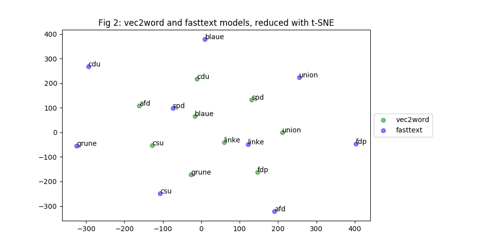

# ...

> **Date:** 04.05. *(Due: 07.05.)*  
> **Name:** `PhTr` Philipp Trenz  
> **Code:** [git](https://github.com/philipptrenz/Text-Visualisation-in-Practice/tree/master/04_word_embeddings)  
> **Session:** [Word Embeddings](../index)

----

## Intro

In last weeks blogpost I wrote about using tf-idf vectorization and
t-SNE dimensionality reduction for investigations on Wikipedia articles
of all 709 members of the German Bundestag. In this weeks blogpost I
continue this research by keeping the same source data. Nevertheless
this week is about _word embeddings_.

## Approach

To evaluate the possibilities of word embeddings, I decided to compare
the results of the two popular word embeddings algorithms _vec2word_ and
_fasttext_, which both are available within the _gensim_ Python library.
As the interfaces are implemented similar within the framework, a
comparable parameterisation is possible, which provides a good
comparability of the results. 

In order to increase the processability of the texts by the algorithms,
I have fundamentally revised the preprocessing pipeline compared to last
week. It now consists of the following steps:

* Tokenization
* Removal of non ASCII characters
* Conversion to lower case
* Removal of punctuation
* Replacement of numbers
* Removal of stop words
* Stemming of words
* Lemmatizing of words

## Results


```
    size = 200
    window = 5
    min_count = 50
    sentences = df['article'] 
    total_examples = len(df['article'])
    epochs = 10
```





## Findings
