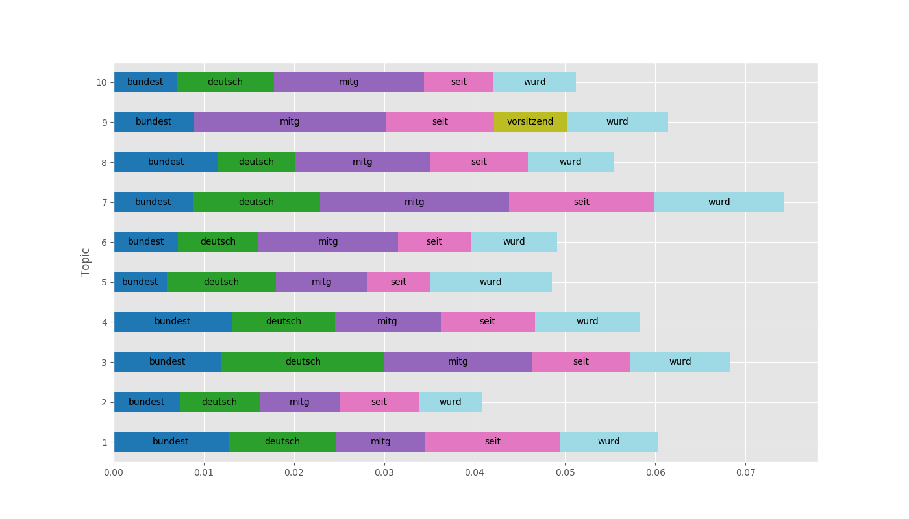
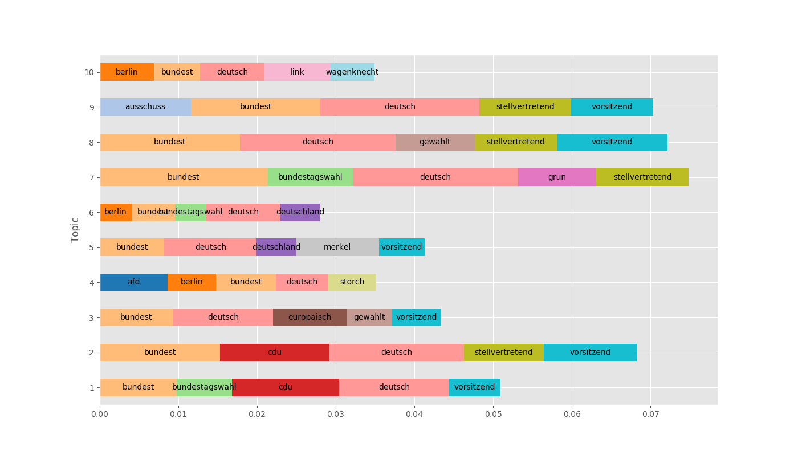
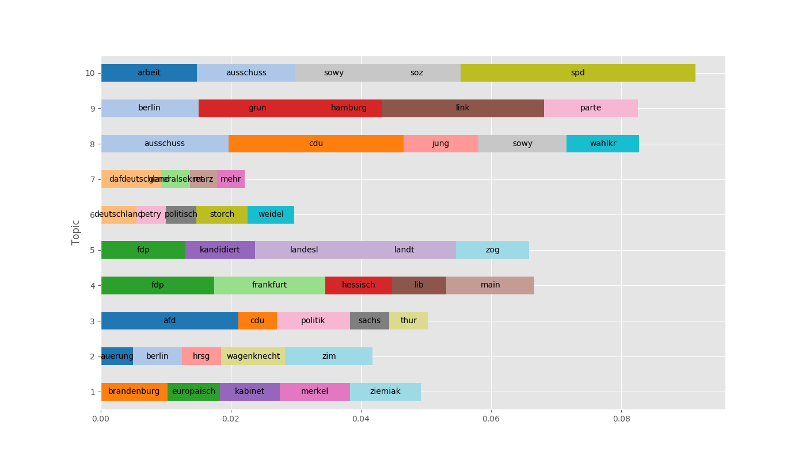

# Topic Modeling on Wikipedia articles of politicians

> **Date:** 16.05. *(Due: 14.05.)*  
> **Name:** `PhTr` Philipp Trenz  
> **Code:**
> [git](https://github.com/philipptrenz/Text-Visualisation-in-Practice/tree/master/05_topic_modeling)  
> **Session:** [Topic Modeling](../index)

----

## Intro

In this weeks blog post we will focus on
[topic modeling](https://en.wikipedia.org/wiki/Topic_model) using the
from the last weeks known data set of Wikipedia articles of members of
the German Bundestag.

It is to be examined whether the Wikipedia articles, although they
report about the persons themselves and not explicitly about their
political topics, provide information on topics, that are, for example,
of political relevance.

## Approach

For generating the topic model, the prepared data of last week as well
as the
[Latent Dirichlet Allocation (LDA)](https://en.wikipedia.org/wiki/Latent_Dirichlet_allocation)
algorithm out of the [gensim](https://radimrehurek.com/gensim/) Python library was used.

## Results

In order to obtain an initial assessment of the possibilities of the LDA
algorithm on the basis of the selected data set, the algorithm was
trained after the normalization of the text, and the top 10 of the
generated topics were output, each with the five strongest weighted
words, as Figure 1 shows.

The output made it clear that the removal of stop words performed during
normalization was insufficient in that the LDA algorithm generated the
most highly valued topics based on words of low information content. For
this reason, additional stop words were manually removed from the
documents and another model and plot were generated.

The results in Figure 2 shows that the extended filtering of words did
not allow the LDA algorithm to produce satisfying topic compilations.
That all politicians are members of the German Bundestag is obviously
clear from the respective Wikipedia articles and was successfully
recognized by LDA, which is generally pleasing. However, since the
selection of documents already implies this knowledge, this insight of
the LDA model is of little relevance. Therefore, once again, the
documents underlying the LDA model were manually edited to remove
additional tokens so that the algorithm can hopefully find topics based
on relevant information. The plotted result is shown in Figure 3.

## Findings

After the elaborate manual correction of the documents, the trained LDA
model provides the distinct topics shown in Figure 3. At first glance,
the five most influential words for the compilation do not reveal
clearly distinguishable topic blocks, suggesting an underdistinct set of
documents. On closer examination, which is not possible in the context
of this assignment, however, interesting connections between the tokens
might be discoverable.
