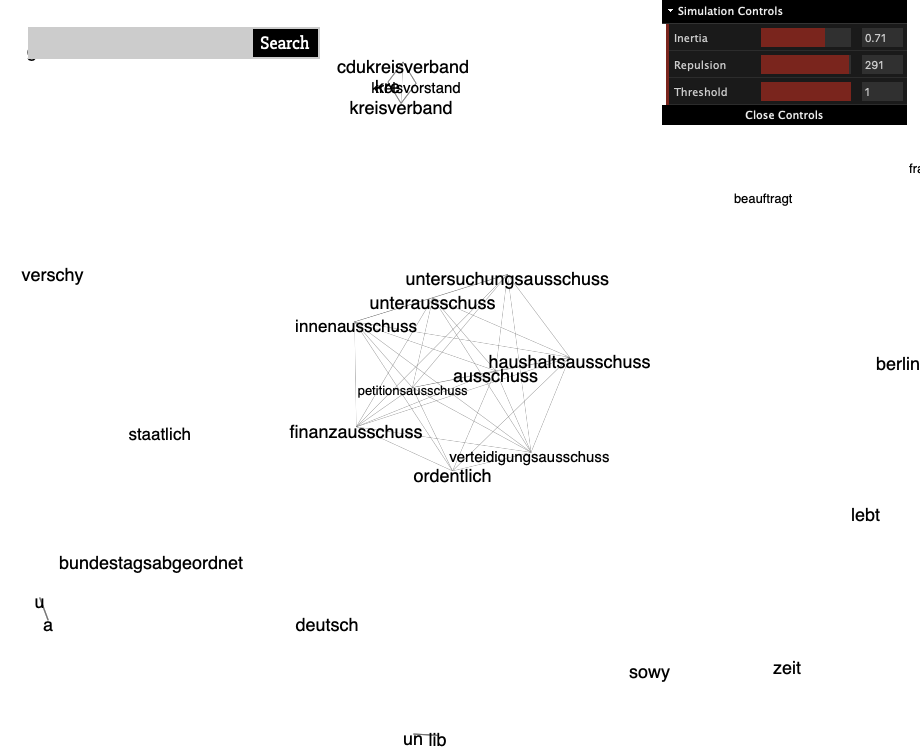

# Text graph, co-occurrance, fasttext and more

> **Date:** 18.05. *(Due: 21.05.)*  
> **Name:** `PhTr` Philipp Trenz  
> **Code:**
> [git](https://github.com/philipptrenz/Text-Visualisation-in-Practice/tree/master/06_text_graphs)  
> **Session:** [Text Graphs](../index)

----

## Intro

In this week's blog post, the dataset of the Wikipedia articles of all
members of the Bundestag is analyzed and visualized using a
[text graph](https://en.wikipedia.org/wiki/Text_graph).

## Approach

To generate the text graph already known metrics are used: The nodes of
the graph represent the words across all documents. 

To select relevant words, co-occurrance at the document level of each
word is considered. A threshold of 40 limits the number of nodes (so a
word must appear in at least 40 documents to be represented in the
graph) and determines the size of the node.

The selection and weighting of the edges is based on a trained fast text
model to represent both statistical and semantic similarity. For this,
the cosine similarity of the token vectors between every two nodes is
calculated and the 1000 most similar pairs are added as edges to the
graph. 

## Results

The following pictures show parts of the graph, which was rendered with
D3.js.

## Findings

The calculation of the co-occurance of each of the approximately 30,000
tokens over the 709 Wikipedia articles of politicians in Python was
extremely computationally demanding. Therefore, a multi-process
calculation was performed for this task, which still led to a
calculation time of about half an hour. The fact that the calculation
was already so elaborate for this dataset was very interesting for me.
The use of analytic engines like
[Apache Spark](https://spark.apache.org) could bring significant
performance improvements at this point. 

Due to the introduced threshold value for the cosine similarity of nodes
contains many subgraphs, which sometimes consist of only one node, as
Figure 1 shows. In particular, some of the larger subgraphs depict
similarities in the spelling of words, as shown in Figures 2 and 3.
Others, however, also create a clustering of content, like the graph in
Figure 4. Other subgraphs, as in Figure 5, do not show any meaningful
connection of the clustered nodes.

Finally, it can be said that the calculated graph probably provides more
information about the results on applying a fasttext model on Wikipedia
articles by politicians than interesting content conclusions on the text
corpus. The reason for this may be a combination of the selection of
statistical methods and the very similar types of content and structure
of the selected Wikipedia articles.
