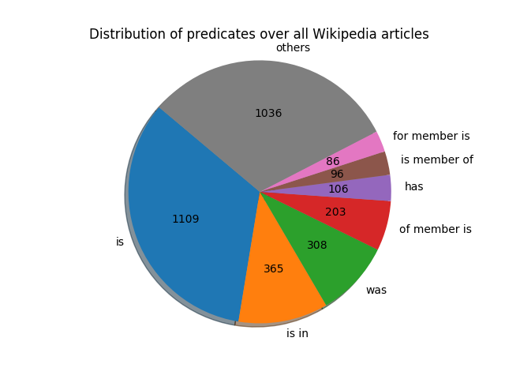

# ...

> **Date:** 24.05. *(Due: 28.05.)*  
> **Name:** `PhTr` Philipp Trenz  
> **Code:**
> [git](https://github.com/philipptrenz/Text-Visualisation-in-Practice/tree/master/07_knowledge_graphs)  
> **Session:** [Knowledge Graphs](../index)

----

## Intro

As the topic of this weeks blogpost are
[Ontologies and Knowledge Graphs](https://en.wikipedia.org/wiki/Ontology_(information_science)),
I chose to investigate Wikipedia articles again.

## Approach

As I wanted to use the
[OpenIE annotator](https://stanfordnlp.github.io/CoreNLP/openie.html)
within the [Stanford CoreNLP](http://stanfordnlp.github.io) and it only
provides models only for the English language, I had to change my
dataset. Instead of the members of the German Parliament I'm retrieving
the Wikipedia articles about the members of the
[United Kingdom House Of Commons](https://de.wikipedia.org/wiki/House_of_Commons).
As a basis this
[list of MPs elected in the 2017 United Kingdom general election](https://en.wikipedia.org/wiki/List_of_MPs_elected_in_the_2017_United_Kingdom_general_election).

### Install
 
To install CoreNLP the JavaSDK 1.8 as well as loading the compiled
sources of the server is required. The scripts included in the
repository provide an easy way to load an execute the CoreNLP server.

```bash
# Load CoreNLP for OpenIE with Models for German
sh get_corenlp.sh

# Start CoreNLP
sh start_corenlp.sh
```

After starting the server, requests can be sent to it via port 9000. For
this task I use the Python package `pycorenlp`.

```python
from pycorenlp import StanfordCoreNLP
nlp = StanfordCoreNLP('http://localhost:9000')
```

## Result

After mining the new dataset, normalizing the Wikipedia articles and
setting up the processing pipeline, which took quite long due to several
software and compatibility issues, the CoreNLP processing results
exemplary in the following for the MP Stephen Kinnock:

```
Stephen Kinnock:
	'Stephen Nathan Kinnock (born 1 January 1970) is a British Labour Party politician who has been the Member of Parliament (MP) for Aberavon since the 2015 general election'
		 ('is', 'Kinnock', 'British')
	'His wife is the former Danish Prime Minister Helle Thorning-Schmidt'
		 ('is', 'His wife', 'former Danish Prime Minister Helle Thorning-Schmidt')
		 ('is', 'His wife', 'former Prime Minister Helle Thorning-Schmidt')
	'His father, Neil Kinnock, is a former Leader of the British Labour Party and was a European Commissioner and Vice President of the European Commission'
		 ('was European Commissioner of', 'His father', 'Commission')
		 ('was Commissioner of', 'His father', 'European Commission')
		 ('father', 'His', 'Neil Kinnock')
		 ('was', 'His father', 'Commissioner')
		 ('is', 'His father', 'former Leader')
		 ('was Commissioner of', 'His father', 'Commission')
		 ('was', 'father', 'European')
		 ('is former Leader of', 'His father', 'Labour Party')
		 ('is former Leader of', 'His father', 'British Labour Party')
		 ('was', 'His father', 'European Commissioner')
		 ('was European Commissioner of', 'His father', 'European Commission')
	'His mother is a former Labour Party MEP.'
		 ('is', 'His mother', 'former Labour Party MEP')
```

Looking at all touples over all 650 Wikipedia articles of the members of
UK House of Commons, which are detected by OpenIE, the following
distribution of predicates can be seen:



## Findings

...
